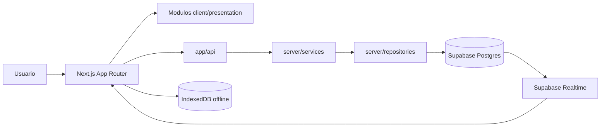
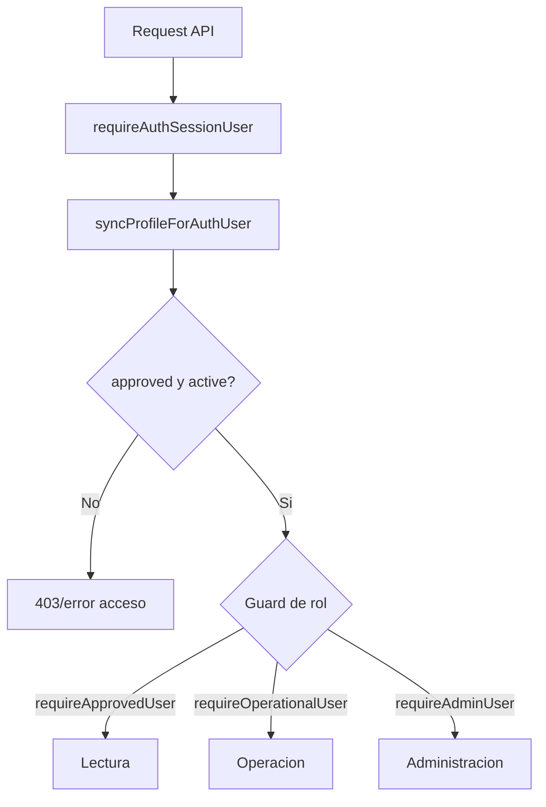
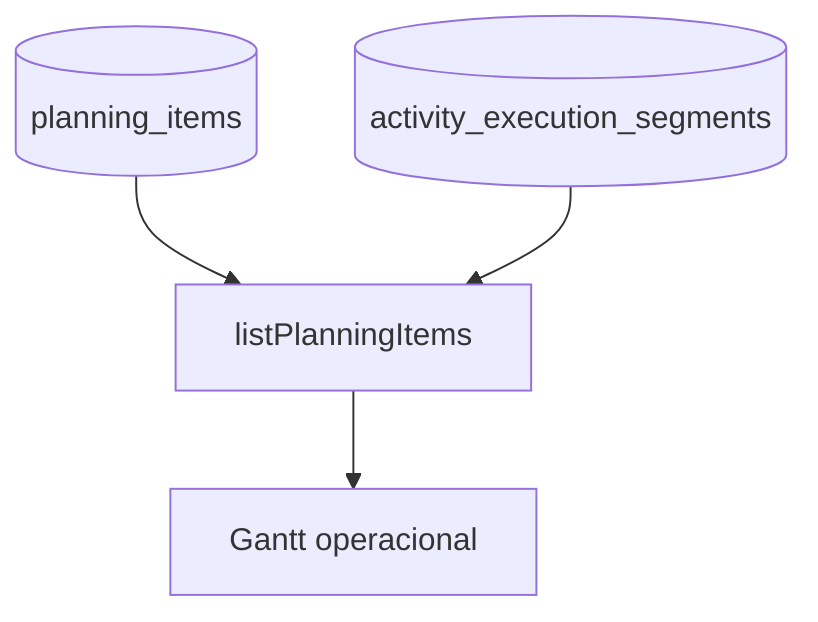
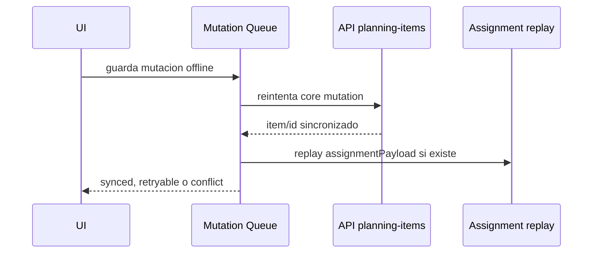

# Arquitectura tecnica

## Resumen

`mineria-mvp` es una aplicacion web operacional para planificacion minera, registro de ejecucion real, interferencias, asignaciones de recursos, campos configurables y reportes.

La aplicacion usa Next.js App Router con TypeScript, Supabase Auth/Postgres como backend activo, rutas API internas, repositorios server-side y cache offline en IndexedDB.



## Stack y dependencias principales

Dependencias runtime principales:

- `next`: framework web con App Router.
- `react` y `react-dom`: UI.
- `@supabase/supabase-js`: Auth, queries server-side y realtime.
- `lucide-react`: iconografia.
- `next-themes`: tema visual.
- `xlsx`: generacion de Excel en reportes.
- `clsx`, `tailwind-merge`, `class-variance-authority`: utilidades de estilos.

Dependencias de desarrollo:

- `typescript`.
- `eslint` y `eslint-config-next`.
- `vitest`.
- `tailwindcss` y `@tailwindcss/postcss`.

## Estructura general

```text
src/app                         Rutas Next.js y API routes
src/components                  Componentes UI compartidos
src/lib                         Utilidades transversales
src/modules                     Modulos de dominio
src/server                      Servicios, repositorios, auth server-side
supabase/sql                    Migraciones SQL
docs                            Documentacion tecnica y funcional
```

Convencion dominante:

- `src/modules/<dominio>/contracts`: tipos y contratos compartidos.
- `src/modules/<dominio>/application`: logica client-side o transformaciones de aplicacion.
- `src/modules/<dominio>/presentation`: componentes y helpers de UI.
- `src/server/services`: reglas de negocio server-side.
- `src/server/repositories`: acceso a Supabase.
- `src/app/api`: entrada HTTP para operaciones server-side.

## Next.js

La aplicacion usa App Router.

Rutas principales:

- `/`: carta Gantt operacional.
- `/dashboard`: resumen basado en reportes.
- `/reports`: reportes operacionales y exportacion.
- `/catalog`: administracion de catalogos operacionales, Cabecera Operacional y assignments.
- `/admin/users`: administracion de usuarios.
- `/admin/audit`: auditoria.
- `/login`: ingreso y solicitud de acceso.
- `/auth/callback`: callback de autenticacion.
- `/offline`: vista offline.

API routes principales:

- `/api/profile/sync`
- `/api/auth/request-access`
- `/api/users`
- `/api/audit-events`
- `/api/planning-items`
- `/api/planning-catalog`
- `/api/assignment-types`
- `/api/assignment-fields`
- `/api/assignment-field-options`
- `/api/planning-assignments`
- `/api/reports`

Las rutas API validan usuario/rol, normalizan input y delegan en servicios server-side.

## Supabase

Supabase es el proveedor activo para:

- Auth.
- Postgres.
- RLS.
- Realtime.
- Cliente admin server-side con service role.

El limite tecnico esta centralizado en:

- `src/server/db/supabase.ts`

Ese archivo expone:

- `getSupabaseServerClient()`
- `getSupabaseAuthAdminClient()`

Ambos usan `SUPABASE_URL` y service role desde variables de entorno server-side.

## Roles y permisos

Los roles estan definidos en `src/server/services/access.service.ts`:

- `admin`
- `operator`
- `viewer`

Estados de aprobacion:

- `pending`
- `approved`
- `rejected`

Reglas server-side:

- `requireApprovedUser`: exige perfil aprobado y activo.
- `requireAdminUser`: exige rol `admin`.
- `requireOperationalUser`: permite `admin` u `operator`.

Uso actual:

- Catalogos, usuarios y auditoria administrativa requieren admin.
- Escritura operacional requiere admin u operator.
- Viewer queda en lectura.
- Usuarios pendientes, rechazados o inactivos no pasan los guards normales.



## Catalogo operacional

El catalogo operacional alimenta formularios de planificacion.

Entidades principales:

- Categorias: `actividad`, `interferencia`.
- Tipos de actividad/interferencia.
- Detalles por tipo.
- Niveles.

Archivos relevantes:

- `src/server/services/planning-catalog.service.ts`
- `src/server/repositories/planning-catalog.repository.ts`
- `src/modules/planning/presentation/use-planning-catalog-admin.ts`
- `src/components/planning/operational-catalog-page.tsx`
- `src/components/planning/catalog-admin-workspace.tsx`

Solo administradores pueden administrar catalogos. Operativos y visualizadores ven la pagina de catalogo como restringida.

## Programados

Los programados se almacenan en `planning_items`.

Caracteristicas:

- Tienen `tracking_type = 'programado'`.
- Incluyen fecha, horario, turno, categoria, tipo, descripcion y notas.
- Usan Cabecera Operacional como unica identidad configurable.
- Pueden tener asignaciones target-aware con `target_kind = planning_item`.
- Se muestran en la capa programada de la carta Gantt.

Backend:

- `src/server/services/planning-items.service.ts`
- `src/server/repositories/planning-items.repository.ts`
- `src/app/api/planning-items/route.ts`

## Activity execution segments

Los reales e interferencias se almacenan en `activity_execution_segments`.

Caracteristicas:

- Representan ejecucion real.
- Pueden ser categoria `actividad` o `interferencia`.
- Se relacionan con un `activity_group_id`.
- Pueden referenciar `planning_item_id`.
- Tienen `segment_order`.
- Pueden tener asignaciones target-aware con `target_kind = execution_segment`.

Backend:

- `src/server/repositories/planning-segments.repository.ts`
- `src/server/services/planning-items.service.ts`

La API de planning combina programados y segmentos reales para entregar una lista operacional unica a la UI.



## Custom Fields retirados

Los custom fields fueron retirados de backend/API y de la experiencia operacional.
Cabecera Operacional cubre identidad, filtros, Gantt y reportes; Asignaciones cubre
recursos repetibles y atributos asociados.

Tablas legacy eliminadas por migracion destructiva:

- `planning_custom_fields`
- `planning_custom_field_options`
- `planning_custom_field_values`

Backend/API, modulos cliente, repositorios, servicios y presentacion fueron eliminados.

## Assignments

Assignments modela recursos asociados a registros operacionales.

Catalogo de assignments:

- `assignment_types`
- `assignment_fields`
- `assignment_field_options`

Valores operacionales:

- `planning_assignments`
- `planning_assignment_values`

Un tipo de asignacion tiene campos. Un campo puede ser texto, numero, fecha, booleano, select o multi select. Las opciones de campos select/multi select tienen `metadata jsonb`.

La UI de catalogo permite:

- Crear y editar tipos.
- Crear y editar campos.
- Crear y editar opciones.
- Editar `metadata` JSON de opciones.
- Configurar `config` JSON en campos.

## Assignments target-aware

`planning_assignments` soporta dos targets excluyentes:

- `planning_item_id`
- `execution_segment_id`

Contrato compartido:

```ts
type AssignmentTarget = {
  target_kind: "planning_item" | "execution_segment";
  target_id: number;
};
```

Reglas de base de datos:

- Exactamente uno de `planning_item_id` o `execution_segment_id` debe existir.
- Indices unicos parciales por target:
  - `planning_item_id + assignment_type_id + instance_order`
  - `execution_segment_id + assignment_type_id + instance_order`

RPC:

- `replace_planning_assignments`
- `replace_assignments_for_target`

Flujo:

```mermaid
flowchart LR
  UI[PlanningAssignmentsForm] --> Target[AssignmentTarget]
  Target --> API[/api/planning-assignments]
  API --> Service[planning-assignments.service]
  Service --> RPC[replace_assignments_for_target]
  RPC --> DB[(planning_assignments)]
  DB --> Values[(planning_assignment_values)]
```

Titulos funcionales:

- Programado: `Asignaciones planificadas`.
- Real actividad: `Asignaciones reales`.
- Interferencia: `Recursos involucrados`.

Offline:

- Programados mantienen flujo offline/cola.
- Reales e interferencias bloquean guardado offline de asignaciones con mensaje claro.

## Metadata y derivaciones de assignments

Las opciones de assignment fields tienen `metadata jsonb`.

Ejemplo:

```json
{
  "familia": "Jumbo"
}
```

Los campos select pueden declarar derivaciones en `config`:

```json
{
  "derives": {
    "familia": "metadata.familia"
  }
}
```

Implementacion:

- `getMetadataPathValue(option.metadata, path)`
- `applyAssignmentDerivations(type, instance, sourceField, selectedOption)`

Soporte actual:

- Se aplica al cambiar un campo `select`.
- Paths `metadata.<key>`.
- Campo destino por `slug` dentro del mismo assignment type.
- Destinos `text`.
- Destinos `select`, buscando opcion por `value` y luego por `label`.
- No soporta destino `multi_select`.
- Config incompleta se ignora sin error.

## Reporting

Reporting se construye desde:

- `planning_items` para programados.
- `activity_execution_segments` para reales/interferencias.

Repositorio:

- `src/server/repositories/reports.repository.ts`

Servicio:

- `src/server/services/reports.service.ts`

Calculo:

- `src/modules/reporting/application/reporting-calculations.ts`

El servicio carga en paralelo:

- Filas programadas.
- Filas reales/interferencias.
- Tipos de assignments.
- Assignments por planning item.
- Assignments por execution segment.

Luego `buildReportFromSourceRows` filtra, calcula resumen, breakdowns de Cabecera
Operacional y `assignment_rows`.

Las assignment rows son target-aware:

- `target_kind`
- `target_id`

No se heredan asignaciones entre programado y real.

```mermaid
flowchart TD
  ReportsAPI[/api/reports] --> ReportsService[getReport]
  ReportsService --> Planned[planning_items]
  ReportsService --> Real[activity_execution_segments]
  ReportsService --> Assign[assignment types + assignments]
  ReportsService --> OH[operational header fields + values]
  Planned --> Calc[reporting-calculations]
  Real --> Calc
  OH --> Calc
  Assign --> Calc
  Calc --> Response[ReportResponse]
```

## Export Excel

El export Excel se implementa en:

- `src/modules/reporting/presentation/reporting-xlsx-export.ts`

Dependencia:

- `xlsx`

Formato actual:

- Una sola hoja: `Detalle operacional`.
- Columnas base.
- Columnas dinamicas de Cabecera Operacional.
- Columnas dinamicas de assignments por tipo y campo.

Encabezado de assignment:

```text
{assignment_type_label} - {field_label}
```

Ejemplos:

- `Equipo - Codigo`
- `Equipo - Familia`
- `Cuadrilla - Turno`

Si hay colision de encabezados, se agrega slug, por ejemplo:

```text
Equipo - Codigo (codigo)
```

Valores:

- Usa `assignment_rows.values[].value`.
- Multiples instancias se separan con `; `.
- Agrupa por `target_kind + target_id`.
- Funciona para planning items y execution segments.
- No crea hoja separada.

CSV:

- La exportacion CSV se mantiene en la pagina de reportes.
- No reutiliza las columnas dinamicas de assignments del Excel.

## Offline

El soporte offline se divide en:

- Cache de datos.
- Snapshots de reportes/dashboard/usuarios.
- Cola de mutaciones de planning.
- Perfil cacheado.
- Fallback de red.

Almacenamiento:

- IndexedDB.
- DB: `mineria-offline-store`.
- Version: `1`.
- Stores:
  - `keyval`
  - `planningByDate`

Archivo principal:

- `src/lib/localOfflineStore.ts`

Keys relevantes:

- `planning-catalog`
- `planning-assignment-types`
- `planning-assignments`
- `assignments`
- `auth-profile`
- `planning-mutation-queue`

Snapshots de reportes:

- `src/modules/reporting/offline/reporting-offline-snapshot.ts`

La app puede mostrar datos cacheados cuando detecta offline. Para reportes, dashboard y usuarios admin se guardan snapshots con `updatedAt`.

## Flujo de sincronizacion

La cola de mutaciones de planning vive en:

- `src/modules/planning/sync/planning-mutation-queue.ts`
- `src/modules/planning/sync/planning-mutation-queue-store.ts`
- `src/modules/planning/sync/planning-sync-models.ts`

Cada mutacion pendiente puede incluir:

- Metodo.
- Payload base.
- `client_mutation_id`.
- Assignment payload.
- Estado de conflicto.
- `syncedPlanningItemId` cuando el core ya fue sincronizado.

Flujo de replay:



Reglas:

- Errores retryable conservan la cola.
- Errores no retryable marcan conflicto.
- Si el core ya se sincronizo, se puede reintentar solo asignaciones usando `syncedPlanningItemId`.
- Mutaciones conflictivas quedan visibles hasta descartarlas.

## Cache

Capas de cache:

- Catalogo operacional.
- Planning por fecha.
- Tipos de assignments.
- Assignments por target.
- Perfil auth.
- Snapshots de reportes y dashboard.
- Usuarios admin para vista offline.

Hay soporte para claves scoped por:

- `userId`
- `organizationId`
- `siteId`

Actualmente el helper conserva fallback a claves legacy cuando no encuentra una clave scoped.

## Realtime

La aplicacion incluye adaptadores de realtime en:

- `src/modules/planning/realtime/planning-realtime-adapter.ts`
- `src/modules/planning/presentation/use-planning-realtime.ts`

El objetivo es refrescar vistas de planning cuando cambian datos relevantes. Los errores de realtime se registran como eventos operacionales y no bloquean la UI.

## Auditoria

La auditoria usa:

- `audit_events`
- `src/lib/auditLog.ts`
- `src/server/services/audit.service.ts`
- `src/server/repositories/audit.repository.ts`
- `src/modules/audit/*`

Se registran acciones sobre:

- Planning items.
- Activity execution segments.
- Catalogos.
- Custom fields retirados, solo como labels historicos si existen audit logs antiguos.
- Assignments.
- Usuarios.

La vista administrativa de auditoria esta restringida a administradores.

## Migraciones relevantes

Orden actual en `supabase/sql`:

- `001_schema.sql`: esquema base, perfiles, planning items, catalogos iniciales de base y audit/logica principal.
- `002_seed_catalog.sql`: seed de catalogo operacional.
- `003_security_realtime.sql`: seguridad/RLS/realtime.
- `004_planning_custom_fields.sql`: legacy, crea tablas retiradas por `013`.
- `005_planning_custom_field_icons.sql`: legacy, ajusta tablas retiradas por `013`.
- `006_assignment_catalog.sql`: catalogo de assignment types, fields y options con `config`/`metadata`.
- `007_planning_assignments.sql`: assignments operacionales, valores y RPCs.
- `008_assignment_type_icons.sql`: iconos de tipos de asignacion.
- `009_operator_role.sql`: rol operativo.
- `010_target_aware_assignments.sql`: migracion incremental target-aware para DBs donde `007` ya estaba aplicada.
- `011_operational_header.sql`: Cabecera Operacional configurable.
- `012_operational_header_hardening.sql`: constraints minimas de Cabecera Operacional.
- `013_drop_planning_custom_fields.sql`: elimina tablas legacy de Custom Fields.
- `014_drop_level_front_legacy.sql`: elimina columnas legacy Nivel/Frente, `planning_levels` y metadata tecnica temporal.

Nota importante:

- `007_planning_assignments.sql` contiene la definicion consolidada actual.
- `010_target_aware_assignments.sql` existe para aplicar cambios target-aware de forma incremental en bases reales que ya tenian `007` aplicada.

## Convenciones de diseño y UI

Convenciones observadas en codigo:

- Componentes funcionales React con TypeScript.
- Formularios controlados por estado local.
- Modulos de dominio separados por `application`, `contracts`, `presentation`, `offline`, `sync` cuando aplica.
- Iconografia con `lucide-react`.
- Componentes locales para Gantt, sheets, modales, tabla de reportes y catalogo.
- CSS global en `src/app/globals.css`.
- Textos de UI principalmente en espanol.
- Reportes y export Excel desacoplados: UI de reportes no depende del formato de Excel.

## Limites actuales relevantes

- Custom fields se completan en programados en la UI principal.
- Assignments reales/interferencias requieren conexion para guardar.
- Derivaciones de assignments solo se aplican en frontend al cambiar un select.
- Derivaciones no soportan destino `multi_select`.
- CSV no exporta columnas dinamicas de assignments.
- La administracion de catalogos requiere conexion y rol admin.
